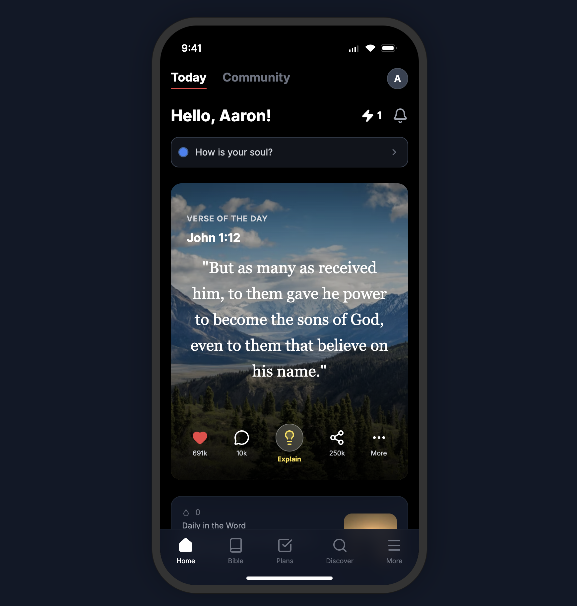
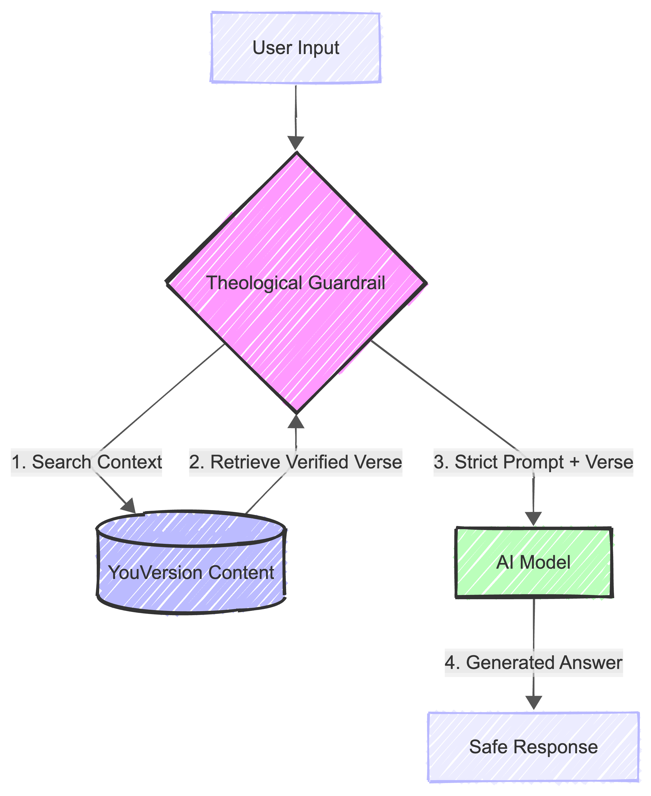

# Spiritual Companion MVP 🕊️

> **Active, personalized spiritual engagement for Gen Z, ensuring 100% theological safety.**

📹 **[Watch 90-Second Demo](https://youtu.be/NqS5iJpFjl8)**



## 📖 Vision
This project is a **Proof of Concept (PoC)** designed for **YouVersion**, created by **Aaron (19)**. 

The goal is to bridge the gap between static content consumption and active spiritual dialogue. By leveraging advanced AI with strict theological guardrails, we provide a safe space for users to explore their faith, ask difficult questions, and receive biblically grounded answers in real-time.

### Key Features
-   **Mindset Pulse**: Interactive check-ins ("How is your soul?") that offer personalized spiritual impulses.
-   **Conversational Memory**: The AI remembers the context of the conversation, allowing for deep, meaningful follow-up questions.
-   **Deep Dive**: "Explain this verse" feature with modes for different understanding levels (Simple, Historical, Application).
-   **Prayer Architect**: Helps users formulate prayers based on their current feelings and needs.

---

## 🛡️ Theological Safety & RAG Architecture

One of the biggest challenges with LLMs (Large Language Models) in a religious context is "hallucination" or generating theologically incorrect content. We solve this using **RAG (Retrieval Augmented Generation)**.



### How it Works (The "Theological Guardrail")

1.  **User Input**: The user asks a question or shares a feeling (e.g., "I feel anxious").
2.  **Vector Search (The Anchor)**: Instead of letting the AI answer immediately, we first search our **Vector Database** (FAISS).
    *   We convert the user's query into a mathematical vector (using HuggingFace embeddings).
    *   We compare this vector against our indexed database of the **King James Version (KJV) Bible**.
    *   We retrieve the most relevant verses that semantically match the user's situation.
3.  **Strict Prompting**: We construct a prompt for the AI (Google Gemini 2.5) that includes:
    *   The User's Query.
    *   The **Retrieved Verses** (Context).
    *   **Strict Instructions**: "You are a spiritual companion. Use ONLY the provided context to answer. Do not make up theology."
4.  **Safe Response**: The AI generates a response that is empathetic and conversational but **strictly grounded** in the retrieved Bible verses.

### Why Vector Databases?
A Vector Database allows us to search for *meaning*, not just keywords.
-   *Keyword Search*: "Anxiety" -> finds verses with the word "anxiety".
-   *Vector Search*: "I feel like the walls are closing in" -> finds verses about fear, refuge, and God's peace, even if they don't use the exact words.

👉 **[Read the full technical breakdown of our Vector Ingestion Pipeline here](docs/VECTOR_INGESTION.md)**

---

## 🛠️ Tech Stack

-   **Frontend**: HTML5, Tailwind CSS, Vanilla JS (Mobile-First "App" Design).
-   **Backend**: Python, FastAPI.
-   **AI Engine**: Google Vertex AI (Gemini 2.5 Flash).
-   **Orchestration**: LangChain.
-   **Database**: FAISS (Vector Store) with HuggingFace Embeddings (`sentence-transformers/all-MiniLM-L6-v2`).
-   **Data Source**: King James Version (KJV) Bible.

## 🚀 Getting Started

### Prerequisites
-   Python 3.10+
-   Google Cloud Project with Vertex AI API enabled.

### Installation

1.  **Clone the repository**
    ```bash
    git clone https://github.com/telaaron/faith-rag-engine.git
    cd faith-rag-engine
    ```

2.  **Set up Backend**
    ```bash
    python -m venv .venv
    source .venv/bin/activate
    pip install -r backend/requirements.txt
    ```

3.  **Environment Variables**
    Create a `.env` file in the `backend/` directory:
    ```env
    GOOGLE_APPLICATION_CREDENTIALS="path/to/your/service-account.json"
    ```

4.  **Run the Server**
    ```bash
    uvicorn backend.app.main:app --reload
    ```

5.  **Launch the App**
    Open `frontend/index.html` in your browser (or use Live Server).

---

*Created with ❤️ and ☕ by Aaron.*
